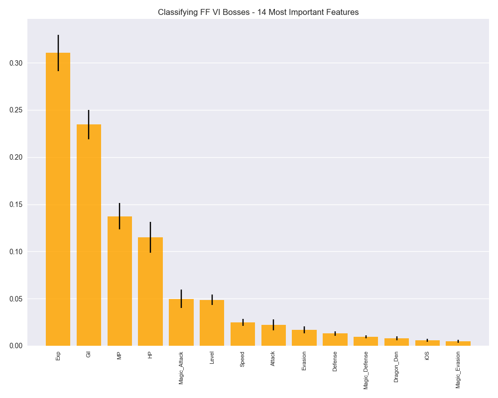
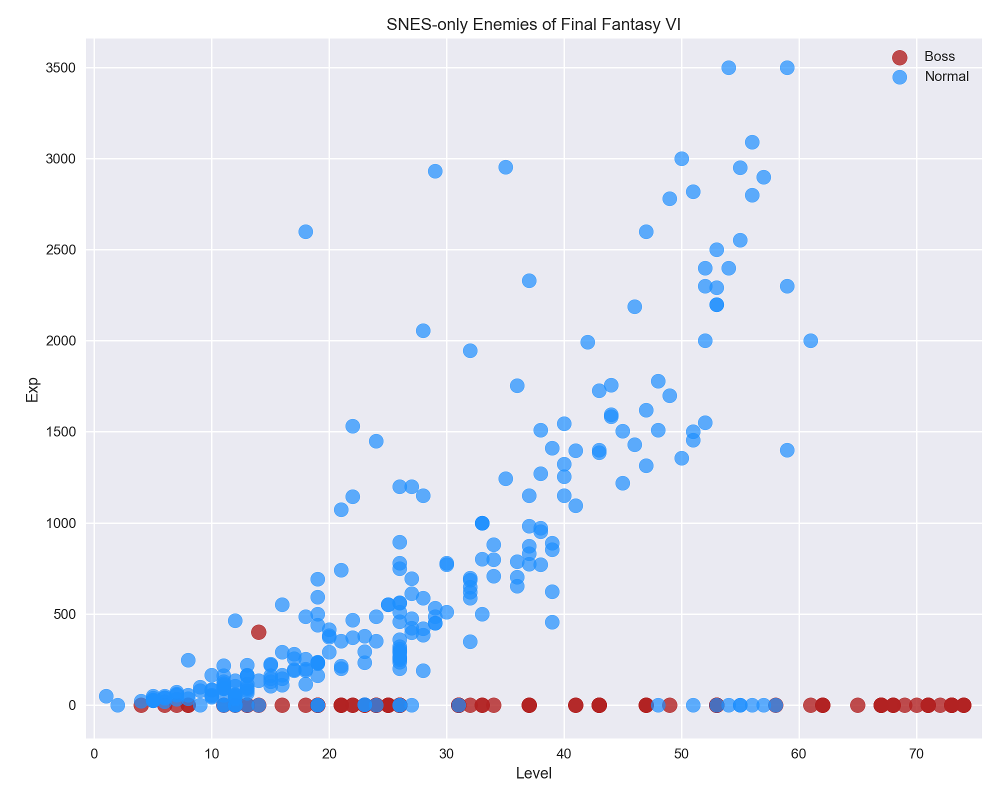
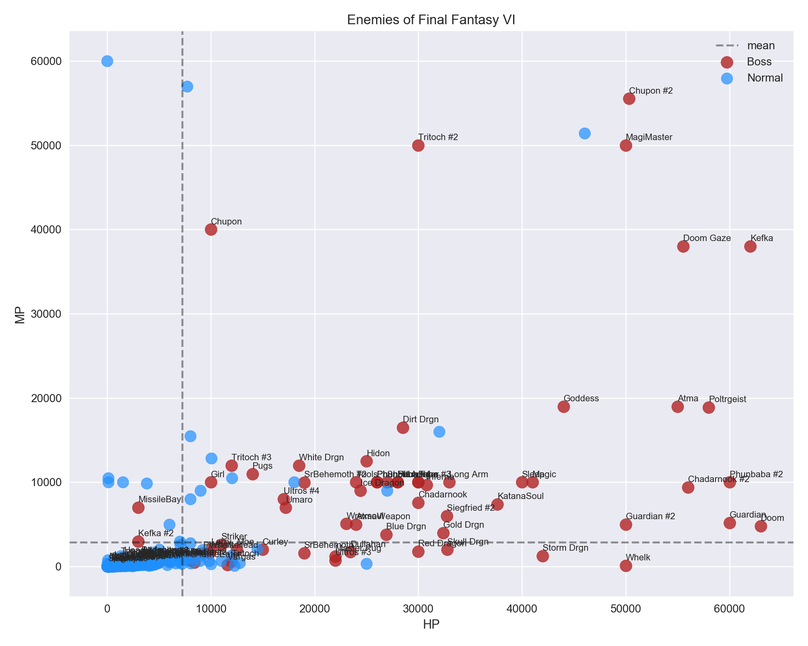
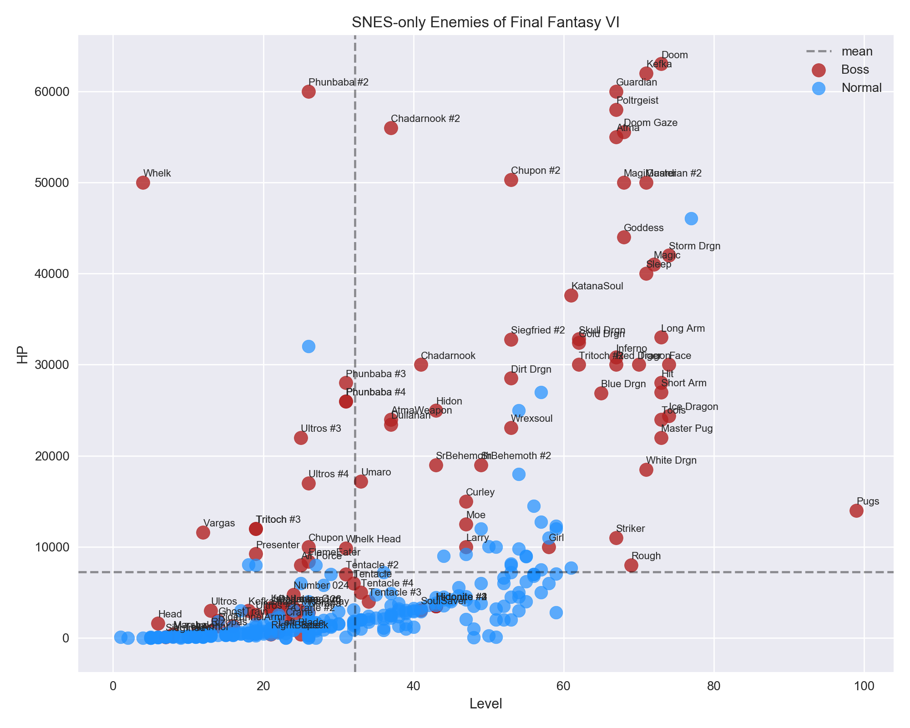
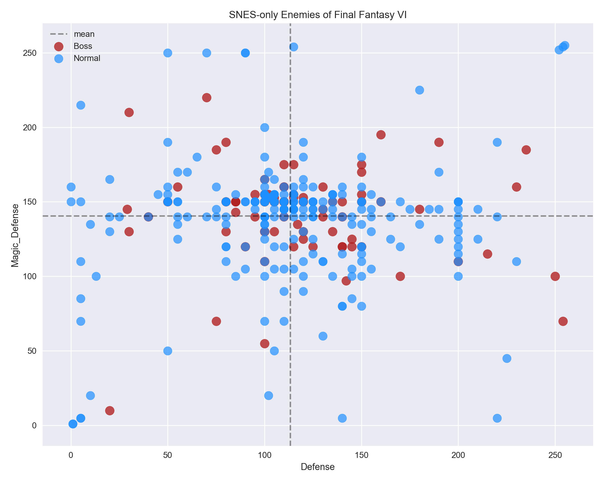

# Final Fantasy VI
### Father and Son Data Party

My son has been playing the old SNES game [Final Fantasy VI](https://en.wikipedia.org/wiki/Final_Fantasy_VI) on iOS.  Being one of the truly cherished games from my childhood, we decided to make a fun data project out of it.  It's a great way to expose him to data science and programming with a topic he enjoys.

For any RPG one of the best sources of data is its (likely) extensive bestiary.  Final Fantasy VI is no exception, upping the enemy count from its predecessors as well as the range of their abilities.  The mobile re-releases of the game in the 2010s brought numerous end-game enemy additions for high level players.  After searching online we found a pair of text file bestiary guides, one covering only the original SNES enemies and one with the recent mobile version enemy roster.  We chose [the modern version](data/FF6_bestiary.txt) which would allow us to do some investigation of the newly included baddies.  

We did some further work using the [Final Fantasy Wiki](http://finalfantasy.wikia.com/wiki/List_of_Final_Fantasy_VI_enemies) to label each enemy as a __boss__ or normal encounter.  We thought this would allows us to see if we could predict whether or not an enemy was a boss based on their basic character data (see below).  In addition to building a basic classification model we also did some exploratory data analysis on the stats for each enemy.  

There are various text categories for each enemy as well, such as their location, spells and abilities they're weak against, items to steal or dropped, and their attack animations.  These variables could be dummied and investigated in a model, but they also make for a simple dataset ripe for text analysis.  

#### Bestiary Dataset Features
(SNES in parenthesis)

Feature             | Description               | Var Type  | Min           | Max
--------------------|---------------------------|-----------|---------------|----
Name                | Mobile version name       | str       | Abaddon       | Zurvan
SNES Name           | Original SNES name        | str       | 1st Class     | Zone Eater
Location            | Place encountered         | str       | Airship       | Zozo
Level               | Level                     | int       | Yes            | 99
HP                  | Hit Points                | int       | Yes            | 65,500 (63,000)
MP                  | Magic Points              | int       | 0             | 65,000 (60,000)
Attack              | Physical Att. Power       | int       | Yes            | 250
Magic Attack        | Magical Att. Power        | int       | 0             | 100 (55)
Defense             | Physical Def. Power       | int       | 0             | 255
Magic Defense       | Magical Def. Power        | int       | Yes            | 255
Evasion             | Physical Evasion          | int       | 0             | 255 (250)
Magic Evasion       | Magical Evasion           | int       | 0             | 255 (250)
Speed               | Speed                     | int       | Yes            | 99
Gil                 | Gil won by player         | int       | 0             | 50,000 (30,000)
EXP                 | Experience won            | int       | 0             | 50,000 (14,396)
Steal               | Items to steal            | list      | Air Anchor    | X-Potion
Drops               | Items dropped at death    | list      | Air Knife     | Zwill Crossblade
Elemental Immunity  | Elements immune to        | list      | Earth         | Wind
Weak Against        | Elements weak vs.         | list      | Earth         | Wind
Absorbs             | Elements absorbed         | list      | Earth         | Wind
Type                | Special monster type      | category  | N/A           | Undead
Status Immunity     | Statuses immune to        | list      | Berserk       | Zombie
Vulnerable To       | Statuses weak vs.         | list      | Berserk       | Zombie
Inherent Status     | Default statuses          | list      | Berserk       | Zombie
Other Immunity      | Ability immunities        | list      | Control       | None
Rage                | Attack by Gau's Rage      | str       | 1000 Needles  | Wing Snap
Sketch              | Attacks by Relm's Sketch  | list      | Absolute Zero | Yawn
Control             | Attack by Relm's Control  | str       | Acid Rain     | Zombie Fang
Metamorphose        | Items Metamorphosed into  | list      | Angel Ring    | Viper Darts
MP Kill             | Kill with MP attack       | bool      | False         | True
Imp Criticals       | Critical hits as Imp      | bool      | False         | True
Run Difficulty      | Ease to run from          | category  | Easy          | Can't Run Away
Attack Visual       | Animation for each attack | str       | Chain Flail   | Trident

 

### Can We Predict if an Enemy is, [Like, a Boss](https://www.youtube.com/watch?v=NisCkxU544c)?
In the interest of keeping things simple we ran an out-of-the-box Random Forest classifier as our model.  
To get a more robust picture of the model's learning of the dataset we ran the model fifteen times using a random splitting of the dataset each time (70% train, 30% test) to make our predictions.  We aggregated the results and report them below.

##### Class Balance
The total number of enemies in the bestiary is 406.  Of these, 110 are classified as being a, or part of a, boss encounter.  This gives a 72:27 ratio of normal-to-boss enemies.  This imbalance means that our baseline for any model classifying enemies as boss-or-not is ~72%, since if we blindly labeled every single enemy in the bestiary as "not boss" we'd be right 72% of the time.  

Category      | Count
--------------|------
Total Enemies | 406
Bosses        | 110

There are a few steps we can take counteract this inherent imbalance; we'll use only two basic ones here, but they're still effective and smart to utilize.  The first method was to stratify the data when we split it, ensuring a proportionate distribution of classes in both the training and testing data.  The second was to use a weighted scoring metric which mathematically rewards or diminishes the value of each classification based on the class weights.

##### Prediction Accuracy
Using the weighted F1 Score, we were able to achieve appreciable success.  The average training data F1 score was around 94.55% with the average testing data F1 score slightly below at 92.13%, as expected.  Pruning of the trees in the Random Forest helped reduce overfitting to narrow the gap between the two.  (If there's a wide gap between your training and testing scores, you're likely overfitting your model).  Also as expected, the variance in the training scores for all fifteen predictions was smaller (0.0083) than that for the testing scores (0.0220).

###### 15 Random Runs with All Enemies
Run | Train F1 (%) | Test F1 (%) | ∆
----|--------------|-------------|-----
1   | 94.17        | 89.75       | 4.42
2   | 93.50        | 92.83       | 0.67
3   | 95.85        | 92.72       | 3.13
4   | 94.50        | 88.99       | 5.51
5   | 93.15        | 94.29       | -1.14
6   | 94.18        | 88.99       | 5.19
7   | 93.17        | 92.10       | 1.07
8   | 95.19        | 95.92       | -0.73
9   | 94.85        | 89.48       | 5.37
10  | 95.85        | 93.60       | 2.25
11  | 95.50        | 92.83       | 2.67
12  | 94.17        | 90.57       | 3.60
13  | 94.50        | 91.28       | 3.22
14  | 94.45        | 95.96       | -1.51
15  | 95.13        | 92.59       | 2.54
Avg.| 94.55        | 92.13       | 2.42
Std.| 0.0083       | 0.0220      | -.0137

##### Feature Importance
The most predictive feature in the dataset for determining whether an enemy was a boss or not was (drumroll emoji)... _Experience Won_ and _Gil Won_!  

###### Feature Ranks
Feature           | Importance
------------------|-----------
1. Experience     | 31.51%
2. Gil            | 22.24%
3. MP             | 14.38%
4. HP             | 10.90%
5. Level          | 5.29%
6. Magic_Attack   | 5.25%
7. Speed          | 2.58%
8. Attack         | 1.98%
9. Defense        | 1.36%
10. Evasion       | 1.34%
11. Dragon_Den    | 1.02%
12. Magic_Defense | 0.93%
13. iOS           | 0.72%
14. Magic_Evasion | 0.49%

This is somewhat surprising initially because our first hunch was that the characteristics of the bosses, such as their magic attack or physical defense or evasion would separate them from normal enemies.  But this is where understanding the data comes into play.  

We must remember that feature importance doesn't tell us whether having more or less of something is important for predicting the target, only that _having_ one of those two characteristics -- high or low in some variable -- is important.  A quick glance at the mean values for the experience that bosses give the player when defeated shows the reason why: _bosses don't give Experience or Gil!_  

That's an unexpected finding.  Generally speaking, bosses are the toughest enemies in the game at the point in which they're encountered.  You'd expect to get the most experience and the most money upon victory.  In many RPGs this _is_ the case.  In Final Fantasy VI (and, perhaps, in other early-generation Final Fantasies) it isn't.  The reward for beating most bosses is, apparently, continuation of the story and a bit of personal satisfaction. Actually, we all know the real purpose of boss fights is getting to hear the [decisively awesome boss battle theme](https://www.youtube.com/watch?v=iXOzwiJZjGg).  Awwwww yeahhhhh!

There is a distinction to make here, however.  As mentioned earlier the mobile versions of the game released in the last few years brought about the addition of end-game bosses (and an end-game dungeon).  These bosses _do_ give experience.  Considering they have no relevance to the story, which is originally what defined a boss battle -- an enemy the player must defeat in order to advance the game's story -- and that they weren't originally included in the game, I think a fair investigation can exclude them from the analysis.

Doing so gives a smaller dataset of only 366 enemies with 96 bosses, and ups the predictive ability of the model since only one of the bosses of those 96 gives experience.  

###### SNES Enemies Only Dataset
Category      | Count | Num. Giving Exp | % Giving Exp
--------------|-------|-----------------|-------------
Total Enemies | 366   | 246             | 67.2%
Non-Bosses    | 270   | 245             | 90.7%
Bosses        | 96    | Yes              | 1.04%

With this trimmed, SNES-only dataset we can see why the model latches onto _Experience_ as the biggest predictor for whether an enemy is a boss or not.  Over 90% of non-bosses give the player some experience upon being defeated, while only 1% of bosses do (side note: the only boss to give experience is the "Hell's Rider" enemy, the mounted soldier patrolling the wintry peaks above Narshe during Kefka's World of Balance assault).  The same goes for _Gil_ as well, with bosses giving none.

The feature importances remain the same as well, with slightly increased _Experience_ importance and zero importance for Dragon Den.

The classification results improve as well, showing that the SNES-only database is slightly easier to make predictions on because of the lack of experience-giving bosses.  With a mean test F1 score of 96.87% from fifteen randomized runs, it's clear we can detect whether an enemy would be a boss or not in the original SNES version of Final Fantasy VI.

###### SNES Enemies Only Mean Predictions
Here are the results from running the model fifteen times with only the SNES enemies list.
Measure | Train F1 | Test F1 | ∆
--------|----------|---------|---
Mean    | 98.14%   | 96.87%  | 1.27
Std.    | .0047    | .0124   | -.0076

 

### Visual Investigation
With the results from our model in hand, it is usually fun to do some visual inspection of the features or trends reported above.

###### Experience as Level Increases
With bosses colored red and non-bosses blue, we see that bosses just don't give experience regardless of how high their level is.  As non-bosses become higher in level they give more experience.  This plot confirms what our model picked up.

###### Bosses Have More HP and MP
Referencing the feature importances above, _HP_ and _MP_ are ranked 3rd and 4th, respectively.  This makes sense as we'd expect bosses to have more of both statistics since they are meant to be more challenging enemies.  Their values in these two stats just happens to vary some, which makes sense, while _Experience_ does not, giving it the stronger predictive power.  The mean for the SNES-only population of enemies is marked by dashed lines for both axes.  We see an indistinguishable cluster of non-bosses (blue) in the bottom left of the plot, while bosses are distributed at a much higher range of both HP and MP.  We will quantify this below.

###### Bosses Have More HP per Level
To belabor the point, bosses have more health per level as we'd expect from the previous plot. The same is true for MP.

###### Bosses Are Average in Other Attributes
We'd think bosses would have higher values in all stats than normal enemies, but this isn't the case.  It's only true for HP and MP.  Here we look at their _Defense_ and _Magic Defense_ and see no separation at all from non-bosses.

### The Probability of Being a Boss
(Hint: if named Jonpaul, P > .99)  
For each enemy in the database the model makes a prediction: is this enemy a boss or not?  While the final classification is binary ('yes' or 'no'), the degree to which the model "believes" in this classification is not.  For each enemy the model assigns a probability that they are indeed what the model has classified them as; in other words, the model tells us _how confident_ it is about each enemy being a boss or not.  

I thought it would be fun to look at these probabilities to see exactly which enemies the model says are the most "boss-like".  Here's a table of the top 15 most probable bosses according to this model, with a full list in the appendix at the end of this post.

###### Most Probable Bosses
SNES_Name        | Actual Boss? | Probability | Prediction | Correct? | Location
-----------------|--------------|-------------|------------|----------|---------
1. White Drgn    | Yes          | 95.64%      | Boss       | Yes      | Cultists' Tower
2. Doom          | Yes          | 95.62%      | Boss       | Yes      | Kefka's Tower (Final Battle)
3. Blue Drgn     | Yes          | 95.32%      | Boss       | Yes      | Ancient Castle
4. Sleep         | Yes          | 95.30%      | Boss       | Yes      | Kefka's Tower (Final Battle)
5. Master Pug    | Yes          | 95.28%      | Boss       | Yes      | Cave to Ancient Castle
6. Red Dragon    | Yes          | 95.28%      | Boss       | Yes      | Phoenix Cave
7. Storm Drgn    | Yes          | 95.26%      | Boss       | Yes      | Mt. Zozo
8. Tiger         | Yes          | 95.21%      | Boss       | Yes      | Kefka's Tower (Final Battle)
9. Ice Dragon    | Yes          | 95.15%      | Boss       | Yes      | Narshe Cliffs
10. Gold Drgn    | Yes          | 95.04%      | Boss       | Yes      | Kefka's Tower
11. Tools        | Yes          | 94.85%      | Boss       | Yes      | Kefka's Tower (Final Battle)
12. Inferno      | Yes          | 94.80%      | Boss       | Yes      | Kefka's Tower
13. Short Arm    | Yes          | 94.61%      | Boss       | Yes      | Kefka's Tower (Final Battle)
14. Striker      | Yes          | 94.57%      | Boss       | Yes      | Kefka's Tower
15. Face         | Yes          | 94.40%      | Boss       | Yes      | Kefka's Tower (Final Battle)

For fun let's look at the least likely bosses.

###### Least Probable Bosses
SNES_Name        | Actual Boss? | Probability | Prediction | Correct? | Location
-----------------|--------------|-------------|------------|----------|---------
1. Vindr         | No           | 3.06%       | No         | Yes      | Owzer's Mansion (WoR)
2. Ralph         | No           | 3.18%       | No         | Yes      | Grass Areas (WoR)
3. Muus          | No           | 3.18%       | No         | Yes      | Grass Areas (WoR)
4. Maliga        | No           | 3.19%       | No         | Yes      | Figaro Continent (WoR)
5. Exoray        | No           | 3.20%       | No         | Yes      | Darril's Tomb (WoR)
6. Wild Cat      | No           | 3.22%       | No         | Yes      | Owzer's Mansion (WoR)
7. Poppers       | No           | 3.22%       | No         | Yes      | Umaro's Cave
8. Iron Fist     | No           | 3.23%       | No         | Yes      | Kohlingen Forest
9. Osprey        | No           | 3.23%       | No         | Yes      | Southern Continent (WoR)
10. Gigan Toad   | No           | 3.24%       | No         | Yes      | Southern Continent (WoR)

These results fit well with common sense.  Many of the top fifteen probable bosses are dragons or are found in Kefka's Tower, the game's final dungeon.  Indeed six of the fifteen most probable are from the final battle itself.  Conversely the least likely to be bosses are nearly all random Overworld enemies.

### Hypothesis Testing
Hypothesis testing is one way we can determine whether or not two groups or classes -- such as bosses vs. non-bosses -- are mathematically different from each other (in whatever metric we choose).  Once analyzed, if they are statistically separated beyond a given threshold, we can say they independent from each other with an certain level of confidence (chosen by us; higher confidence means more difficult threshold to pass).  If they are not different enough we can't say that they are actually the same.  Instead all we can say is that the two groups are not different enough to rule out that their measurements merely occurred by chance (again, we determine how strict "chance" is here).

As an example if we measured the difference between bosses' _Experience_ given and non-bosses, we'd find that yes, there is clear statistical evidence that they are different groups (one being basically zero, the other in the hundreds or thousands).

###### Means to an End
 Attribute    | Non-Bosses Mean | Bosses Mean | ∆
--------------|-----------------|-------------|---
Level         | 28.6            | 42.1        |
Exp           | 1029.4          | 4.1         |
Gil           | 577.1           | 365         |
HP            | 2775.7          | 19841.1     |
MP            | 1392.2          | 7101.6      |
Speed         | 34.2            | 42.8        |
Attack        | 15.6            | 23
Magic_Attack  | 10.3            | 8.8
Defense       | 112.0           | 116.4
Evasion       | 10.4            | 5.8
Magic_Defense | 139.3           | 143.6
Magic_Evasion | 1.85            | 1.6
Sample Size   | 96              | 272

(in progress)

### Appendix

SNES_Name     | Actual Boss | Probability | Prediction | Right Prediction?
--------------|------|-------------|-----------|------------
White Drgn    | Yes   | 0.956485    | Boss      | Yes
Doom          | Yes   | 0.956232    | Boss      | Yes
Blue Drgn     | Yes   | 0.953287    | Boss      | Yes
Sleep         | Yes   | 0.953098    | Boss      | Yes
Master Pug    | Yes   | 0.952831    | Boss      | Yes
Red Dragon    | Yes   | 0.952810    | Boss      | Yes
Storm Drgn    | Yes   | 0.952680    | Boss      | Yes
Tiger         | Yes   | 0.952158    | Boss      | Yes
Ice Dragon    | Yes   | 0.951512    | Boss      | Yes
Gold Drgn     | Yes   | 0.950414    | Boss      | Yes
Tools         | Yes   | 0.948505    | Boss      | Yes
Inferno       | Yes   | 0.948053    | Boss      | Yes
Short Arm     | Yes   | 0.946134    | Boss      | Yes
Striker       | Yes   | 0.945745    | Boss      | Yes
Face          | Yes   | 0.944032    | Boss      | Yes
Phunbaba \#3  | Yes   | 0.943571    | Boss      | Yes
Dullahan      | Yes   | 0.942945    | Boss      | Yes
Phunbaba \#4  | Yes   | 0.942805    | Boss      | Yes
Skull Drgn    | Yes   | 0.942409    | Boss      | Yes
Phunbaba      | Yes   | 0.941779    | Boss      | Yes
Ultros \#3    | Yes   | 0.940362    | Boss      | Yes
Doom Gaze     | Yes   | 0.940050    | Boss      | Yes
Hit           | Yes   | 0.939855    | Boss      | Yes
Magic         | Yes   | 0.936566    | Boss      | Yes
Atma          | Yes   | 0.933805    | Boss      | Yes
Hidon         | Yes   | 0.932706    | Boss      | Yes
Kefka         | Yes   | 0.932470    | Boss      | Yes
Phunbaba \#2  | Yes   | 0.931509    | Boss      | Yes
Wrexsoul      | Yes   | 0.930727    | Boss      | Yes
Chadarnook    | Yes   | 0.929414    | Boss      | Yes
Chadarnook \#2| Yes   | 0.929391    | Boss      | Yes
Umaro         | Yes   | 0.927943    | Boss      | Yes
AtmaWeapon    | Yes   | 0.927535    | Boss      | Yes
Poltrgeist    | Yes   | 0.927480    | Boss      | Yes
SrBehemoth \#2| Yes   | 0.926387    | Boss      | Yes
SrBehemoth    | Yes   | 0.920595    | Boss      | Yes
Girl          | Yes   | 0.920220    | Boss      | Yes
Tritoch \#3   | Yes   | 0.919888    | Boss      | Yes
Number 128    | Yes   | 0.919850    | Boss      | Yes
Moe           | Yes   | 0.919292    | Boss      | Yes
Dirt Drgn     | Yes   | 0.918232    | Boss      | Yes
Goddess       | Yes   | 0.917442    | Boss      | Yes
FlameEater    | Yes   | 0.916002    | Boss      | Yes
Tentacle \#2  | Yes   | 0.915898    | Boss      | Yes
Larry         | Yes   | 0.915078    | Boss      | Yes
Tentacle      | Yes   | 0.914851    | Boss      | Yes
Curley        | Yes   | 0.913987    | Boss      | Yes
Tritoch \#2   | Yes   | 0.913260    | Boss      | Yes
SoulSaver     | Yes   | 0.909669    | Boss      | Yes
Tentacle \#4  | Yes   | 0.908459    | Boss      | Yes
MissileBay    | Yes   | 0.905828    | Boss      | Yes
Tritoch       | Yes   | 0.905649    | Boss      | Yes
Tentacle \#3  | Yes   | 0.904011    | Boss      | Yes
Chupon \#2    | Yes   | 0.900924    | Boss      | Yes
Chupon        | Yes   | 0.900552    | Boss      | Yes
Guardian      | Yes   | 0.899279    | Boss      | Yes
Ultros        | Yes   | 0.898088    | Boss      | Yes
Ultros \#2    | Yes   | 0.896964    | Boss      | Yes
Rough         | Yes   | 0.894461    | Boss      | Yes
Ultros \#4    | Yes   | 0.894097    | Boss      | Yes
Crane \#2     | Yes   | 0.892818    | Boss      | Yes
Number 024    | Yes   | 0.891203    | Boss      | Yes
Ifrit         | Yes   | 0.888766    | Boss      | Yes
Kefka \#2     | Yes   | 0.884097    | Boss      | Yes
Long Arm      | Yes   | 0.881370    | Boss      | Yes
Hidonite      | Yes   | 0.878668    | Boss      | Yes
Crane         | Yes   | 0.877504    | Boss      | Yes
Hidonite \#4  | Yes   | 0.874953    | Boss      | Yes
Hidonite \#2  | Yes   | 0.874386    | Boss      | Yes
Guardian \#2  | Yes   | 0.872717    | Boss      | Yes
Hidonite \#3  | Yes   | 0.868432    | Boss      | Yes
Shiva         | Yes   | 0.867825    | Boss      | Yes
Left Blade    | Yes   | 0.862286    | Boss      | Yes
Siegfried \#2 | Yes   | 0.861657    | Boss      | Yes
Pugs          | Yes   | 0.845212    | Boss      | Yes
Laser Gun     | Yes   | 0.838951    | Boss      | Yes
Head          | Yes   | 0.834829    | Boss      | Yes
Air Force     | Yes   | 0.826384    | Boss      | Yes
Specter       | 0    | 0.824626    | Boss      |  No
KatanaSoul    | Yes   | 0.810851    | Boss      | Yes
Whelk         | Yes   | 0.809127    | Boss      | Yes
GhostTrain    | Yes   | 0.802074    | Boss      | Yes
Intangir      | 0    | 0.801050    | Boss      |  No
Vargas        | Yes   | 0.788006    | Boss      | Yes
Whelk Head    | Yes   | 0.774232    | Boss      | Yes
MagiMaster    | Yes   | 0.756835    | Boss      | Yes
M-TekArmor    | Yes   | 0.750494    | Boss      | Yes
Nerapa        | Yes   | 0.737887    | Boss      | Yes
Presenter     | Yes   | 0.736911    | Boss      | Yes
RightBlade    | Yes   | 0.736239    | Boss      | Yes
Speck         | Yes   | 0.724175    | Boss      | Yes
Rizopas       | Yes   | 0.699169    | Boss      | Yes
Allo Ver      | 0    | 0.684843    | Boss      |  No
Dadaluma      | Yes   | 0.679066    | Boss      | Yes
Ipooh         | Yes   | 0.639694    | Boss      | Yes
Naughty       | 0    | 0.633450    | Boss      |  No
Telstar       | 0    | 0.618884    | Boss      |  No
Marshal       | Yes   | 0.568641    | Boss      | Yes
Siegfried     | Yes   | 0.567093    | Boss      | Yes
TunnelArmr    | Yes   | 0.566835    | Boss      | Yes
Piranha       | 0    | 0.482761    | No         | Yes
Soldier \#2   | 0    | 0.423284    | No         | Yes
Brachosaur    | 0    | 0.414558    | No         | Yes
Land Worm     | 0    | 0.411210    | No         | Yes
L.90 Magic    | 0    | 0.404199    | No         | Yes
Nohrabbit     | 0    | 0.377637    | No         | Yes
Scullion      | 0    | 0.358531    | No         | Yes
L.60 Magic    | 0    | 0.340282    | No         | Yes
L.80 Magic    | 0    | 0.340156    | No         | Yes
L.50 Magic    | 0    | 0.327576    | No         | Yes
L.70 Magic    | 0    | 0.316479    | No         | Yes
Magic Urn     | 0    | 0.299061    | No         | Yes
Dragon        | 0    | 0.298808    | No         | Yes
Gigantos      | 0    | 0.297205    | No         | Yes
Tyranosaur    | 0    | 0.297165    | No         | Yes
L.30 Magic    | 0    | 0.291166    | No         | Yes
L.40 Magic    | 0    | 0.289285    | No         | Yes
Cadet         | 0    | 0.283220    | No         | Yes
L.20 Magic    | 0    | 0.283132    | No         | Yes
L.10 Magic    | 0    | 0.274864    | No         | Yes
Behemoth      | 0    | 0.269365    | No         | Yes
Doberman      | 0    | 0.269022    | No         | Yes
Didalos       | 0    | 0.268025    | No         | Yes
Leader        | 0    | 0.259767    | No         | Yes
Rider         | Yes   | 0.251856    | No         |  No
EarthGuard    | 0    | 0.248088    | No         | Yes
Hoover        | 0    | 0.244752    | No         | Yes
Veteran       | 0    | 0.243489    | No         | Yes
Templar       | 0    | 0.240711    | No         | Yes
Soldier       | 0    | 0.235018    | No         | Yes
Cactrot       | 0    | 0.229134    | No         | Yes
Mover         | 0    | 0.221985    | No         | Yes
Prometheus    | 0    | 0.217618    | No         | Yes
Mega Armor    | 0    | 0.214704    | No         | Yes
Grunt         | 0    | 0.212900    | No         | Yes
Doom Drgn     | 0    | 0.210766    | No         | Yes
Peepers       | 0    | 0.207570    | No         | Yes
Sp Forces     | 0    | 0.206382    | No         | Yes
Zone Eater    | 0    | 0.192845    | No         | Yes
Vomammoth     | 0    | 0.176938    | No         | Yes
Steroidite    | 0    | 0.176694    | No         | Yes
Brontaur      | 0    | 0.176499    | No         | Yes
GtBehemoth    | 0    | 0.170180    | No         | Yes
HeavyArmor    | 0    | 0.163533    | No         | Yes
Mantodea      | 0    | 0.157745    | No         | Yes
Dark Force    | 0    | 0.155472    | No         | Yes
Fortis        | 0    | 0.152340    | No         | Yes
Lethal Wpn    | 0    | 0.147822    | No         | Yes
Trixter       | 0    | 0.145940    | No         | Yes
Necromancr    | 0    | 0.141195    | No         | Yes
Outsider      | 0    | 0.140026    | No         | Yes
Goblin        | 0    | 0.138056    | No         | Yes
Retainer      | 0    | 0.136109    | No         | Yes
Dahling       | 0    | 0.134894    | No         | Yes
Crawler       | 0    | 0.134885    | No         | Yes
Grenade       | 0    | 0.131588    | No         | Yes
Evil Oscar    | 0    | 0.129909    | No         | Yes
Vectagoyle    | 0    | 0.126831    | No         | Yes
Sky Base      | 0    | 0.126471    | No         | Yes
Chaos Drgn    | 0    | 0.123935    | No         | Yes
Hemophyte     | 0    | 0.119457    | No         | Yes
Aspik         | 0    | 0.118851    | No         | Yes
Pug           | 0    | 0.114497    | No         | Yes
Mad Oscar     | 0    | 0.108689    | No         | Yes
Rhyos         | 0    | 0.107101    | No         | Yes
Displayer     | 0    | 0.105119    | No         | Yes
Phase         | 0    | 0.105027    | No         | Yes
Brainpan      | 0    | 0.102843    | No         | Yes
Madam         | 0    | 0.102532    | No         | Yes
Black Drgn    | 0    | 0.101233    | No         | Yes
Geckorex      | 0    | 0.097787    | No         | Yes
Dueller       | 0    | 0.096390    | No         | Yes
Opinicus      | 0    | 0.095093    | No         | Yes
FossilFang    | 0    | 0.094904    | No         | Yes
Allosaurus    | 0    | 0.094897    | No         | Yes
Warlock       | 0    | 0.093887    | No         | Yes
Borras        | 0    | 0.093219    | No         | Yes
Aquila        | 0    | 0.089355    | No         | Yes
TumbleWeed    | 0    | 0.086053    | No         | Yes
Samurai       | 0    | 0.084244    | No         | Yes
Sprinter      | 0    | 0.083980    | No         | Yes
Crusher       | 0    | 0.083612    | No         | Yes
Uroburos      | 0    | 0.083260    | No         | Yes
Lobo          | 0    | 0.083017    | No         | Yes
Spek Tor      | 0    | 0.081628    | No         | Yes
Still Life    | 0    | 0.080982    | No         | Yes
IronHitman    | 0    | 0.079793    | No         | Yes
HadesGigas    | 0    | 0.079664    | No         | Yes
Parasoul      | 0    | 0.078744    | No         | Yes
Reach Frog    | 0    | 0.076804    | No         | Yes
Boxed Set     | 0    | 0.076108    | No         | Yes
Pterodon      | 0    | 0.076019    | No         | Yes
ChickenLip    | 0    | 0.075282    | No         | Yes
Nightshade    | 0    | 0.074196    | No         | Yes
Chaser        | 0    | 0.073190    | No         | Yes
Sky Cap       | 0    | 0.072534    | No         | Yes
Over-Mind     | 0    | 0.071715    | No         | Yes
Harvester     | 0    | 0.071584    | No         | Yes
Ninja         | 0    | 0.071427    | No         | Yes
Vectaur       | 0    | 0.071297    | No         | Yes
Parasite      | 0    | 0.070652    | No         | Yes
Spit Fire     | 0    | 0.070560    | No         | Yes
Mag Roader \#2| 0    | 0.069588    | No         | Yes
Test Rider    | 0    | 0.069105    | No         | Yes
PlutoArmor    | 0    | 0.068910    | No         | Yes
Bomb          | 0    | 0.068097    | No         | Yes
Ghost         | 0    | 0.068014    | No         | Yes
Anguiform     | 0    | 0.068003    | No         | Yes
Sky Armor     | 0    | 0.067638    | No         | Yes
Chimera       | 0    | 0.066827    | No         | Yes
Orog          | 0    | 0.065812    | No         | Yes
Pm Stalker    | 0    | 0.063962    | No         | Yes
Guard         | 0    | 0.062936    | No         | Yes
Spectre       | 0    | 0.062709    | No         | Yes
HermitCrab    | 0    | 0.062582    | No         | Yes
ProtoArmor    | 0    | 0.062444    | No         | Yes
Mag Roader \#3| 0    | 0.061996    | No         | Yes
Scorpion      | 0    | 0.061475    | No         | Yes
Cruller       | 0    | 0.060974    | No         | Yes
Osteosaur     | 0    | 0.059527    | No         | Yes
Hazer         | 0    | 0.059419    | No         | Yes
Wirey Drgn    | 0    | 0.059264    | No         | Yes
PowerDemon    | 0    | 0.059185    | No         | Yes
Were-Rat      | 0    | 0.059065    | No         | Yes
Bloompire     | 0    | 0.059044    | No         | Yes
Gobbler       | 0    | 0.058531    | No         | Yes
Zombone       | 0    | 0.057317    | No         | Yes
Enuo          | 0    | 0.056991    | No         | Yes
Latimeria     | 0    | 0.056326    | No         | Yes
Sand Horse    | 0    | 0.056161    | No         | Yes
Innoc         | 0    | 0.055614    | No         | Yes
Dark Side     | 0    | 0.055513    | No         | Yes
Woolly        | 0    | 0.054749    | No         | Yes
Covert        | 0    | 0.054392    | No         | Yes
Tap Dancer    | 0    | 0.054212    | No         | Yes
Wart Puck     | 0    | 0.054150    | No         | Yes
Figaliz       | 0    | 0.051151    | No         | Yes
Adamanchyt    | 0    | 0.049496    | No         | Yes
Toe Cutter    | 0    | 0.049348    | No         | Yes
Pan Dora      | 0    | 0.048148    | No         | Yes
Ogor          | 0    | 0.047425    | No         | Yes
Harpy         | 0    | 0.046430    | No         | Yes
Dante         | 0    | 0.046291    | No         | Yes
Rhinotaur     | 0    | 0.045741    | No         | Yes
Prussian      | 0    | 0.045635    | No         | Yes
Karkass       | 0    | 0.045020    | No         | Yes
Critic        | 0    | 0.044856    | No         | Yes
Repo Man      | 0    | 0.044146    | No         | Yes
Rain Man      | 0    | 0.044016    | No         | Yes
SoulDancer    | 0    | 0.043891    | No         | Yes
Barb-e        | 0    | 0.042255    | No         | Yes
Tusker        | 0    | 0.042229    | No         | Yes
Sea Flower    | 0    | 0.042116    | No         | Yes
Sand Ray      | 0    | 0.041879    | No         | Yes
Punisher      | 0    | 0.041182    | No         | Yes
Vaporite      | 0    | 0.040921    | No         | Yes
Suriander     | 0    | 0.040680    | No         | Yes
Misfit        | 0    | 0.040589    | No         | Yes
NeckHunter    | 0    | 0.040583    | No         | Yes
B.Day Suit    | 0    | 0.040286    | No         | Yes
Bleary        | 0    | 0.040172    | No         | Yes
Crawly        | 0    | 0.039902    | No         | Yes
Leafer        | 0    | 0.039794    | No         | Yes
GloomShell    | 0    | 0.039641    | No         | Yes
Areneid       | 0    | 0.039485    | No         | Yes
Hornet        | 0    | 0.039323    | No         | Yes
Fidor         | 0    | 0.038872    | No         | Yes
Vermin        | 0    | 0.038824    | No         | Yes
Merchant      | 0    | 0.038788    | No         | Yes
Slatter       | 0    | 0.038727    | No         | Yes
Dark Wind     | 0    | 0.038556    | No         | Yes
GreaseMonk    | 0    | 0.038168    | No         | Yes
Gold Bear     | 0    | 0.037579    | No         | Yes
Buffalax      | 0    | 0.037375    | No         | Yes
Rhodox        | 0    | 0.037348    | No         | Yes
Ursus         | 0    | 0.037269    | No         | Yes
Junk          | 0    | 0.036831    | No         | Yes
Exocite       | 0    | 0.036805    | No         | Yes
Balloon       | 0    | 0.036685    | No         | Yes
Luridan       | 0    | 0.036630    | No         | Yes
Nautiloid     | 0    | 0.036600    | No         | Yes
Apokryphos    | 0    | 0.036367    | No         | Yes
CrassHoppr    | 0    | 0.035995    | No         | Yes
Officer       | 0    | 0.035746    | No         | Yes
Lich          | 0    | 0.035712    | No         | Yes
Cluck         | 0    | 0.035675    | No         | Yes
Actaneon      | 0    | 0.035647    | No         | Yes
Wizard        | 0    | 0.035519    | No         | Yes
Vector Pup    | 0    | 0.035478    | No         | Yes
Trilium       | 0    | 0.035296    | No         | Yes
Stray Cat     | 0    | 0.035245    | No         | Yes
Ing           | 0    | 0.035186    | No         | Yes
Red Fang      | 0    | 0.035175    | No         | Yes
Deep Eye      | 0    | 0.035053    | No         | Yes
1st Class     | 0    | 0.035032    | No         | Yes
Bogy          | 0    | 0.035026    | No         | Yes
Poplium       | 0    | 0.034955    | No         | Yes
Scrapper      | 0    | 0.034948    | No         | Yes
Beakor        | 0    | 0.034876    | No         | Yes
Coelecite     | 0    | 0.034795    | No         | Yes
Harpiai       | 0    | 0.034790    | No         | Yes
Over Grunk    | 0    | 0.034785    | No         | Yes
Eland         | 0    | 0.034767    | No         | Yes
Hipocampus    | 0    | 0.034668    | No         | Yes
Wild Rat      | 0    | 0.034617    | No         | Yes
Flan          | 0    | 0.034463    | No         | Yes
Brawler       | 0    | 0.034407    | No         | Yes
Commando      | 0    | 0.034361    | No         | Yes
Rhobite       | 0    | 0.034350    | No         | Yes
Primordite    | 0    | 0.034315    | No         | Yes
Pipsqueak     | 0    | 0.034295    | No         | Yes
Trooper       | 0    | 0.034293    | No         | Yes
Rinn          | 0    | 0.034253    | No         | Yes
Bug           | 0    | 0.034186    | No         | Yes
Vulture       | 0    | 0.034129    | No         | Yes
Commander     | 0    | 0.034110    | No         | Yes
Mind Candy    | 0    | 0.034093    | No         | Yes
Iron Fist     | 0    | 0.033971    | No         | Yes
Cirpius       | 0    | 0.033947    | No         | Yes
Joker         | 0    | 0.033837    | No         | Yes
Insecare      | 0    | 0.033769    | No         | Yes
Osprey        | 0    | 0.033757    | No         | Yes
Lizard        | 0    | 0.033739    | No         | Yes
Whisper       | 0    | 0.033726    | No         | Yes
Wyvern        | 0    | 0.033643    | No         | Yes
Bounty Man    | 0    | 0.033454    | No         | Yes
Apparite      | 0    | 0.033447    | No         | Yes
Ralph         | 0    | 0.033380    | No         | Yes
StillGoing    | 0    | 0.033345    | No         | Yes
Mag Roader \#4| 0    | 0.033289    | No         | Yes
Slurm         | 0    | 0.033252    | No         | Yes
Gabbldegak    | 0    | 0.033203    | No         | Yes
Abolisher     | 0    | 0.033131    | No         | Yes
Trapper       | 0    | 0.033092    | No         | Yes
Garm          | 0    | 0.033058    | No         | Yes
Kiwok         | 0    | 0.033018    | No         | Yes
Sewer Rat     | 0    | 0.033017    | No         | Yes
Ceritops      | 0    | 0.032941    | No         | Yes
Mandrake      | 0    | 0.032885    | No         | Yes
Rhinox        | 0    | 0.032847    | No         | Yes
Cephaler      | 0    | 0.032830    | No         | Yes
Mesosaur      | 0    | 0.032787    | No         | Yes
Baskervor     | 0    | 0.032756    | No         | Yes
WeedFeeder    | 0    | 0.032740    | No         | Yes
General       | 0    | 0.032627    | No         | Yes
Lunaris       | 0    | 0.032595    | No         | Yes
Delta Bug     | 0    | 0.032422    | No         | Yes
Chitonid      | 0    | 0.032390    | No         | Yes
Mag Roader    | 0    | 0.032380    | No         | Yes
Poppers       | 0    | 0.032245    | No         | Yes
Nastidon      | 0    | 0.032228    | No         | Yes
Tomb Thumb    | 0    | 0.032145    | No         | Yes
Red Wolf      | 0    | 0.032122    | No         | Yes
Trilobiter    | 0    | 0.032074    | No         | Yes
Wild Cat      | 0    | 0.032006    | No         | Yes
SlamDancer    | 0    | 0.031907    | No         | Yes
Drop          | 0    | 0.031773    | No         | Yes
Humpty        | 0    | 0.031675    | No         | Yes
Gilomantis    | 0    | 0.031628    | No         | Yes
Anemone       | 0    | 0.031534    | No         | Yes
Psychot       | 0    | 0.031447    | No         | Yes
Muus          | 0    | 0.031393    | No         | Yes
Maliga        | 0    | 0.031201    | No         | Yes
Vindr         | 0    | 0.030892    | No         | Yes
Gigan Toad    | 0    | 0.030774    | No         | Yes
Exoray        | 0    | 0.030213    | No         | Yes
