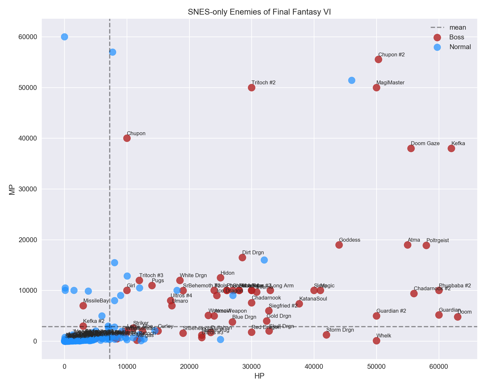

# Final Fantasy VI: Father and Son Data Party

My son has been playing the old SNES game [Final Fantasy VI](https://en.wikipedia.org/wiki/Final_Fantasy_VI) on iOS.  Being one of the truly cherished games from my childhood, we decided to make a fun data project out of it.  It's a great way to expose him to data science and programming with a topic he enjoys.

For any RPG one of the best sources of data is its (likely) extensive bestiary.  Final Fantasy VI is no exception, upping the enemy count from its predecessors as well as the range of their abilities.  The mobile re-releases of the game in the 2010s brought numerous end-game enemy additions for high level players.  After searching online we found a pair of text file bestiary guides, one covering only the original SNES enemies and one with the recent mobile version enemy roster.  We chose [the modern version](data/FF6_bestiary.txt) which would allow us to do some investigation of the newly included baddies.  

We did some further work using the [Final Fantasy Wiki](http://finalfantasy.wikia.com/wiki/List_of_Final_Fantasy_VI_enemies) to label each enemy as a __boss__ or normal encounter.  We thought this would allows us to see if we could predict whether or not an enemy was a boss based on their basic character data (see below).  In addition to building a basic classification model we also did some exploratory data analysis on the stats for each enemy.  

There are various text categories for each enemy as well, such as their location, spells and abilities they're weak against, items to steal or dropped, and their attack animations.  These variables could be dummied and investigated in a model, but they also make for a simple dataset ripe for text analysis.  

#### Bestiary Dataset
(SNES in parenthesis)
Feature             | Description               | Var Type  | Min           | Max
--------------------|---------------------------|-----------|---------------|----
Name                | Mobile version name       | str       | Abaddon       | Zurvan
SNES Name           | Original SNES name        | str       | 1st Class     | Zone Eater
Location            | Place encountered         | str       | Airship       | Zozo
Level               | Level                     | int       | 1             | 99
HP                  | Hit Points                | int       | 1             | 65,500 (63,000)
MP                  | Magic Points              | int       | 0             | 65,000 (60,000)
Attack              | Physical Att. Power       | int       | 1             | 250
Magic Attack        | Magical Att. Power        | int       | 0             | 100 (55)
Defense             | Physical Def. Power       | int       | 0             | 255
Magic Defense       | Magical Def. Power        | int       | 1             | 255
Evasion             | Physical Evasion          | int       | 0             | 255 (250)
Magic Evasion       | Magical Evasion           | int       | 0             | 255 (250)
Speed               | Speed                     | int       | 1             | 99
Gil                 | Gil won by player         | int       | 0             | 50,000 (30,000)
EXP                 | Experience won            | int       | 0             | 50,000 (14,396)
Steal               | Items to steal            | list      | Air Anchor    | X-Potion
Drops               | Items dropped at death    | list      | Air Knife     | Zwill Crossblade
Elemental Immunity  | Elements immune to        | list      | Earth         | Wind
Weak Against        | Elements weak vs.         | list      | Earth         | Wind
Absorbs             | Elements absorbed         | list      | Earth         | Wind
Type                | Special monster type      | category  | N/A           | Undead
Status Immunity     | Statuses immune to        | list      | Berserk       | Zombie
Vulnerable To       | Statuses weak vs.         | list      | Berserk       | Zombie
Inherent Status     | Default statuses          | list      | Berserk       | Zombie
Other Immunity      | Ability immunities        | list      | Control       | None
Rage                | Attack by Gau's Rage      | str       | 1000 Needles  | Wing Snap
Sketch              | Attacks by Relm's Sketch  | list      | Absolute Zero | Yawn
Control             | Attack by Relm's Control  | str       | Acid Rain     | Zombie Fang
Metamorphose        | Items Metamorphosed into  | list      | Angel Ring    | Viper Darts
MP Kill             | Kill with MP attack       | bool      | False         | True
Imp Criticals       | Critical hits as Imp      | bool      | False         | True
Run Difficulty      | Ease to run from          | category  | Easy          | Can't Run Away
Attack Visual       | Animation for each attack | str       | Chain Flail   | Trident

(in progress)

